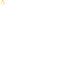
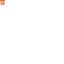

<p align="center">
  
</p>

# native_mouse_cursor

> **Turn any image, SVG, or painted glyph into a _real_ OS mouse cursor** — on
> Flutter desktop, web & Android.

[](https://pub.dev/packages/native_mouse_cursor)
[](LICENSE)
[](#-platform-support)

Unlike a cursor "painted" inside Flutter (a widget that chases the pointer), a
`NativeMouseCursor` is handed to the **operating system**, so the OS compositor
draws it for you. 🪄

## ✨ Why use it

- ⚡ **Zero lag** — tracks the hardware pointer exactly, with no one-frame trail.
- 🫧 **No jitter** — a shadow or glow baked into the bitmap never shimmers, even
  while the cursor rotates.
- 🔌 **Drop-in** — it's a real `MouseCursor`, so it works anywhere a
  `SystemMouseCursors` value does (`MouseRegion`, `InkWell`, scrollbars, …).
- 🔁 **Rotation & mirroring** — spin a glyph by angle or flip it on demand; each
  variant is baked and cached automatically.
- 🌑 **Baked drop shadows** — CSS-style shadows rendered _into_ the bitmap,
  so they stay rock-steady at every angle.
- 🖥️ **HiDPI-crisp** — bakes at your device pixel ratio and re-bakes on change.
- 🖌️ **Optional painted overlay** — on web/desktop, opt into an in-app overlay
  that hides the system cursor and paints a perfectly seamless per-region one.
- 📦 **SPM-first on macOS** — no CocoaPods required.

## 🧩 Platform support

| | Platform | Backend | Status |
| :---: | --- | --- | --- |
|  | **macOS** | `NSCursor` (Swift, **SPM**) | ✅ Supported |
|  | **Windows** | `HCURSOR` (Win32) | ✅ Supported |
|  | **Linux** | `GdkCursor` (GTK) | ✅ Supported |
|  | **Android** | `PointerIcon` (API 24+) | ✅ Supported ² |
|  | **Web** | CSS `url(...)` cursor | ✅ Supported ¹ |
|  | **iOS / iPadOS** | system pointer | ❌ Not possible ³ |

<sub>¹ Each cursor is applied as a CSS `cursor: url(...)` value, sized in logical
px and capped at 128 px (browsers draw a cursor image at its intrinsic pixels and
Chrome ignores larger ones). For **HiDPI crispness** it also emits a
device-resolution image via `image-set(… 2x)`, with the plain `url()` as a
fallback. For a perfectly seamless per-region cursor, wrap your app in
[`NativeMouseCursorOverlay(force: true)`](#-painted-overlay-web--desktop) to paint
the glyph and hide the CSS cursor instead.</sub>

<sub>² Native `PointerIcon` for tablets/Chromebooks with a connected mouse,
trackpad or stylus on **API 24+**. On older devices the system pointer is used.
For a *rotating* cursor, prefer the
[painted overlay](#-painted-overlay-web--desktop) — rapid `PointerIcon` swaps
flicker on Android.</sub>

<sub>³ iPadOS draws and manages the pointer itself — there's no API to install an
arbitrary bitmap cursor, nor to hide the system pointer, so the system pointer is
used. (A painted overlay would just show *through* it as a double cursor.) iPhone
is touch-only — no pointer to replace.</sub>

## 📦 Install

```yaml
dependencies:
  native_mouse_cursor: ^1.0.1
```

```bash
flutter pub add native_mouse_cursor
```

## 🚀 Quick start

The whole API is: **register a source under an id, then `get` it.** 🎯

Everything hard — loading the glyph, rotation, the baked drop shadow, automatic
bitmap sizing, the angle-keyed cache, background warming and DPR re-baking — lives
in the package.

Mix `NativeMouseCursorMixin` into your `State` and the rest is automatic: it
points the cache at the context's `devicePixelRatio` (re-baking on a DPR change)
and rebuilds when a cursor finishes baking — so you can call `svg` / `get`
straight from `build()`:

```dart
import 'package:native_mouse_cursor/native_mouse_cursor.dart';

class _MyState extends State<MyWidget> with NativeMouseCursorMixin {
  @override
  void initState() {
    super.initState();
    // 📝 Register here, NOT in build() — svg() kicks off an async load + bake,
    // so it's a one-time side effect. For an SVG asset that's the whole call;
    // size, shadow and the hotspot all default.
    NativeMouseCursor.svg('rotate', 'assets/icons/rotate.svg');
    //   size:   defaults to the SVG's own (viewBox) size
    //   shadow: defaults to x:0 y:1 blur:1.5 black 50% (σ=blur/2); null = none
  }

  @override
  Widget build(BuildContext context) {
    // 🔍 build() only fetches — the bitmap is baked + cached per angle on
    // demand, and the mixin rebuilds when a fresh one lands.
    return MouseRegion(
      // get() never returns null: until the bitmap is baked it returns
      // SystemMouseCursors.basic, so no `??` is needed.
      cursor: NativeMouseCursor.get('rotate', angle: handleAngleRadians),
      child: handle,
    );
  }
}
```

> 💡 `NativeMouseCursor.has(id)` lets you guard a one-off lazy registration if
> you can't register up front. Prefer not to use the mixin? Call
> `NativeMouseCursor.configure(devicePixelRatio:, onReady:)` yourself once (and
> again whenever the DPR changes) instead.

## 🎨 Cursor sources

Pick the `register` call that matches your glyph — all take the same `id`,
`size`, `shadow` and `hotspot` options:

| Call                        | Glyph source                                      |
| --------------------------- | ------------------------------------------------- |
| 🖼️ `NativeMouseCursor.svg`     | an SVG asset path (re-rasterised from vector)  |
| 🌅 `NativeMouseCursor.image`   | a decoded `ui.Image`                           |
| ✏️ `NativeMouseCursor.draw`    | a `CursorPainter` you paint into a box yourself |
| 🛠️ `NativeMouseCursor.builder` | produce the bitmap yourself per angle + DPR    |

```dart
NativeMouseCursor.image('pointer', myUiImage, size: const Size(24, 24));
```

## 🔁 Rotation

There's no rotation flag — just the `angle` you pass to `get`. A fixed cursor is
simply one you always fetch at the default angle (0), so a single bitmap is baked
and reused:

```dart
NativeMouseCursor.svg('resize-h', 'assets/resize-h.svg');   // ↔
// ...
cursor: NativeMouseCursor.get('resize-h'),
```

For a glyph that turns with a handle, vary the angle — each rotation bucket is
baked and cached the first time it's requested (the at-rest angle is warmed in
the background; the nearest already-baked angle is shown meanwhile). The bitmap
box is always sized for the glyph's diagonal, so it **never clips as it turns**. 🌀

## ↔️ Mirroring

`flipX` / `flipY` are resolved at `get` time, so one registered glyph yields a
mirrored pair on demand — no second asset:

```dart
NativeMouseCursor.svg('hand', 'assets/hand-right.svg');
// the same glyph, flipped — a left hand from the right-hand asset:
cursor: NativeMouseCursor.get('hand', flipX: pointingLeft),
```

Every `(angle, flip)` combination is baked and cached the first time it's asked
for; the unflipped variant is warmed in the background.

## 🎯 Hotspot

By default the click point is the glyph's centre. To anchor it elsewhere (e.g. a
tip-anchored pointer), pass `hotspot` in the **glyph's own coords** (its `size` /
SVG viewBox, origin top-left) — the package centres the glyph in the auto-sized
bitmap and maps the hotspot in for you, so you never deal with box coordinates:

```dart
// A 32×32 arrow whose tip is at (9, 3):
NativeMouseCursor.svg('pointer', 'assets/icons/pointer.svg',
    hotspot: const Offset(9, 3));
```

## 🖥️ High-DPI & disposing

Cursors bake at the DPR passed to `configure` and re-bake automatically when you
call `configure` again with a new one, so they stay crisp on Retina/HiDPI.
Release them when you're done:

```dart
NativeMouseCursor.dispose('rotate');  // 🧹 one cursor
NativeMouseCursor.disposeAll();       // 🧼 everything
```

## 🖌️ Painted overlay (web / desktop)

Want the cursor painted **inside Flutter** instead of as a real OS cursor? Wrap
your app in `NativeMouseCursorOverlay(force: true)`: it hides the system cursor
and paints the *same baked bitmap* at the live pointer position.

```dart
MaterialApp(
  builder: (context, child) =>
      NativeMouseCursorOverlay(force: kIsWeb, child: child!),
  home: const MyHomePage(),
);
```

This is useful where the system cursor can actually be **hidden**:

-  **Web** — a perfectly seamless per-region cursor (the engine's CSS handling
  is best-effort across regions); the CSS cursor is hidden.
-  **Android** — recommended for a **rotating** cursor: the native `PointerIcon`
  flickers when swapped rapidly (an OS quirk), so the painted overlay (system
  pointer hidden) gives smooth rotation.
-    **macOS / Windows / Linux** — preview the painted cursor (the native cursor is
  already pixel-perfect, so you rarely need this).

Off by default; the widget is a transparent pass-through unless `force` is set.

> ⚠️ The overlay is a Flutter widget chasing the pointer, so it has a one-frame
> lag a real OS cursor doesn't. It only works where the system cursor can be
> hidden — **not** on iOS/iPadOS (the system pointer can't be hidden, so a
> painted one would just double it).

## 🧪 Example

The [`example/`](example) app is an interactive showcase — rotation (an arrow
that aims at a dot), mirroring (`flipX`/`flipY`), the hotspot (a red dot marking
the true pointer position), the baked shadow, and all four cursor sources — plus
a switch to toggle the painted overlay.

```bash
cd example && flutter run -d macos   # or -d chrome / windows / linux
```

## ⚙️ How it works

`NativeMouseCursor` extends Flutter's `MouseCursor`. When the framework activates
the cursor for a pointer, the plugin asks the host to make the matching OS cursor
current (`NSCursor.set()` / `SetCursor` / `gdk_window_set_cursor`). Because
activation flows through Flutter's own cursor machinery, the OS cursor isn't
fought over by the engine's system-cursor handling. 🤝

With [`NativeMouseCursorOverlay(force: true)`](#-painted-overlay-web--desktop),
activation is intercepted instead: it keeps the baked bitmaps, hides the system
cursor, and paints the active cursor at the live pointer position.

## 👤 Author

Rami Al-Dhafiri.

## 📄 License

MIT © Rami Al-Dhafiri.
